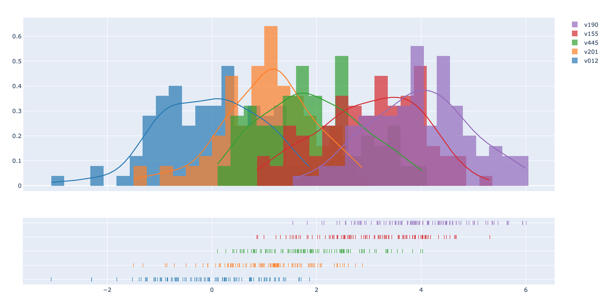
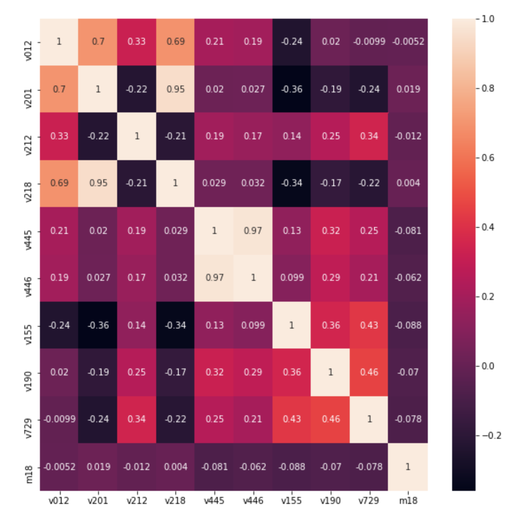
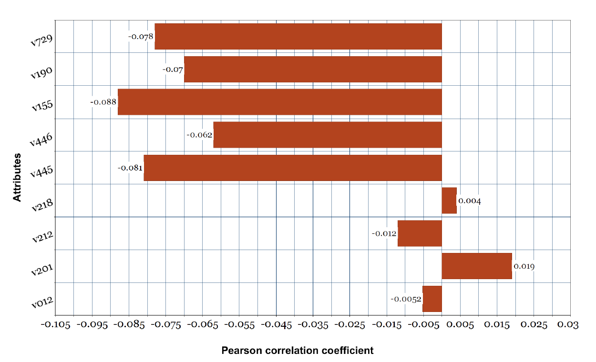

# Correlation-Analysis-LBW-
Here are some scattered codes for Data Pre-processing and Correlation analysis of demographic factors on low birth weight.

## Abstract
According to a national survey in Bangladesh, a south Asian country, approximately 22.6 percent of the new born babies are born with low birth weight (below 2.5 kg or 2500 grams) [13]. There are some key factors regarding low birth weight which are clinically recognized but apart from the clincical perspective some other health and demographic factors also play a vital role in this phenomenon which can be directly or indirectly associated. The purpose of this study is to utilize the potential machine learning algorithms to construct a predictive model for low birth weight given some health and demographic data related to neonatal health condition in the context of Bangladesh. For the predictive analysis, algorithms like Logistic Regression, Naïve Bayes, Random Forest, K-Nearest Neighbor, Support Vector Machine, Neural Network models have been used in the study. The findings of this study can be a guideline for the health professionals as well as the researchers for analyzing low birth weight infants which can help the people in mass to understand and take necessary precautions to avoid of any such event where a child is born with weight less than the average.

## Attribute Distribution Graph

## Correlation Matrix

## Pearson Correlation Score

